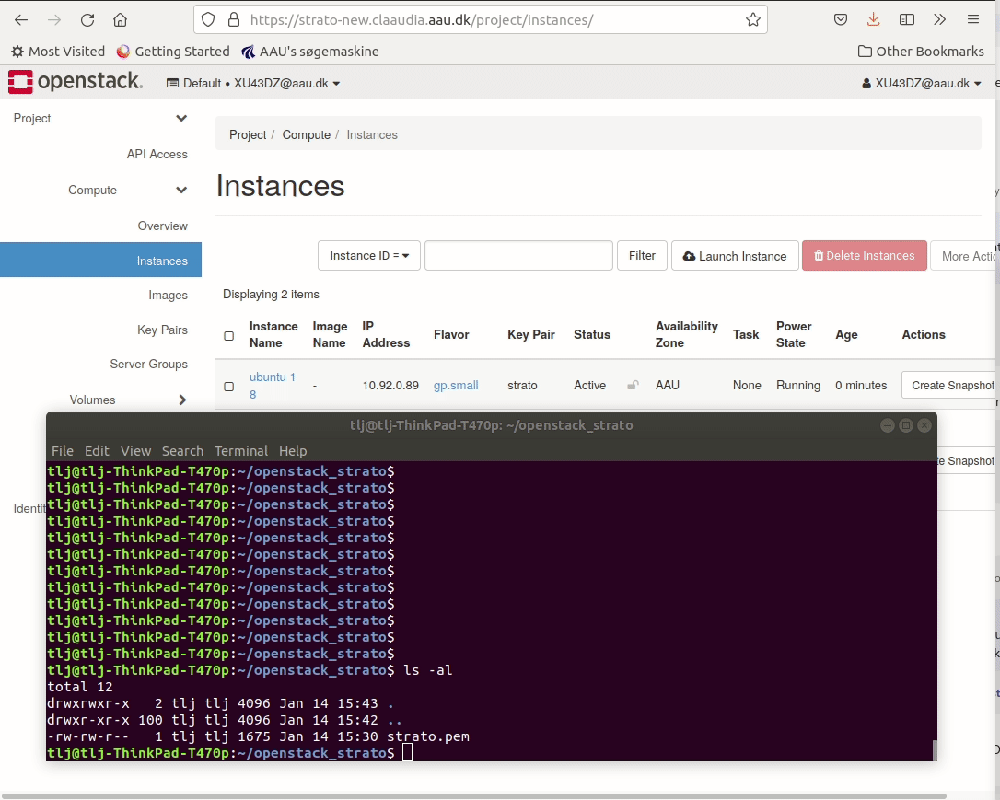

# Ubuntu 20.04 LTS

The default username is **ubuntu** for the 20.04 LTS image. Use a key-pair applied to the instance in the creation, (Unsure what this is, see [**Quick-start - Your first instance**](../quick-start.md)) to access the instance you can use the default IP Adress (You dont need a floating-IP adress)

``` bash
ssh ubuntu@10.92.0.xx -i yourPersonalKey.pem
```



## Installing GPU support

You can pick the flavor "gpu.t4-large" to have access to a T4 GPU.

To get up and running with the GPU you need to run

``` sh
sudo apt update
sudo apt full-upgrade -y
sudo apt install nvidia-headless-460 nvidia-utils-460 -y
sudo reboot
```

To get e.g. torch working with the anaconda distribution you can do:

``` bash
anacondaType=Anaconda3-2021.05-Linux-x86_64.sh
wget -q https://repo.anaconda.com/archive/$anacondaType
chmod +x $anacondaType
./$anacondaType -b -p
sudo rm -f $anacondaType
export PATH="$HOME/anaconda3/bin:$PATH"
conda init bash
conda install pytorch torchvision torchaudio cudatoolkit=11.1 -c pytorch -c nvidia
```

and verify

``` bash
/home/ubuntu/anaconda3/bin/ipython
Python 3.8.8 (default, Apr 13 2021, 19:58:26) 
Type 'copyright', 'credits' or 'license' for more information
IPython 7.22.0 -- An enhanced Interactive Python. Type '?' for help.

In [1]: import torch

In [2]: a = torch.zeros(10).cuda()

In [3]:
```

