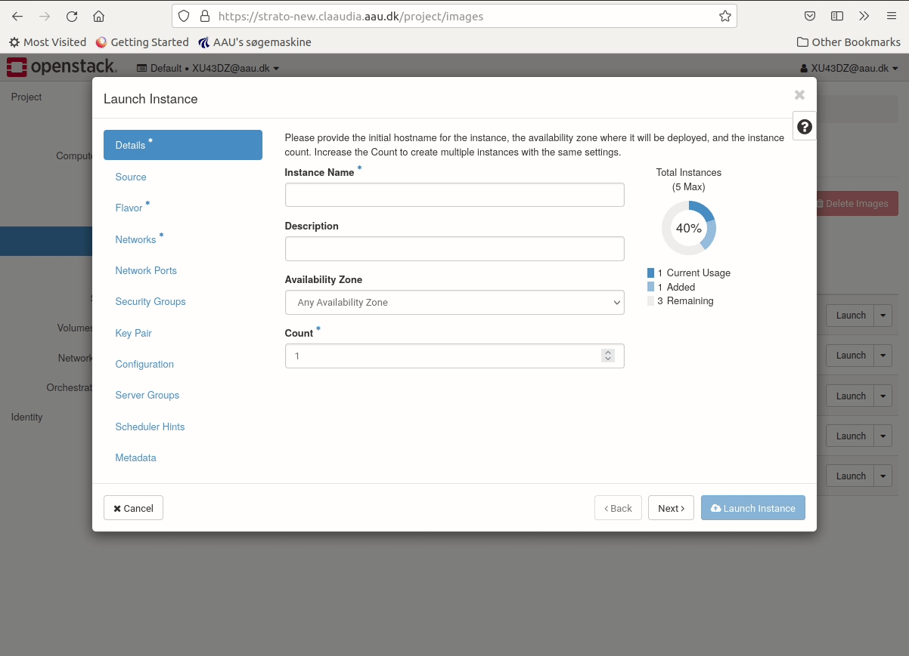

## Login to the Openstack platform
Strato instances are launched in an Openstack platform, which can be accessed at: [**strato-new.claaudia.aau.dk**](https://strato-new.claaudia.aau.dk).

Ensure the *"Authenticate Using"* is set to **WAYF** and click **Connect**. You will be redirected to *"signon.aau.dk/"* where you must login with your aau email and password. When you have entered your credentials, click **LOGIN** and you should be sent to the Openstack dashboard. 

## Initial Openstack setup

Before launching your instance, we need to set a couple of configurations on the Openstack platform. This is necessary to ensure that you can access the instance later. 

### SSH rule

Strato configures port access with **Security groups**. Each group can have a number of rules to permit access. Follow the steps to add port 22 (standard for SSH) to the default security group.

1. Navigate to **Network**
2. Click the sub menu **Security Groups**
3. Click **Manage Rules** on the default Security group
4. Click **Add Rule**
5. Choose **SSH** from dropdown menu.
6. Click **Add**

### Create SSH key pair

When accessing your Strato instance the default is to authenticate with an SSH-key pair. This key pair consists of a public key (stored on the remote device) and a private key (stored only on your local device). For security reasons your SSH-key must be encrypted with a password, and therefore this needs to be done on your local computer. In the following we will create a key pair using the OpenSSH-standard compatible with Strato.

The following will work on most modern terminal emulators. For Windows users we recomend using the preinstalled application *Powershell*.

* Open your terminal application.
* Enter `cd ~/.ssh` to navigate to the conventional directory for SSH-keys.
    * If the directory doesn't exist already, you can create it with: 
        * `mkdir ~/.ssh` MacOS/Linux
        * `md ~/.ssh` on Windows
    * Don't forget to enter the directory afterwards, with `cd ~/.ssh`
    * Type `ls` to se the content of the directory. If this is your first time doing this, the directory should be empty.
* Enter `ssh-keygen` to initiate the key generation.
* When faced with the prompt *"Enter file in which to save the key..."* you can set an optional name for your keyfile.
* Then you will asked to set a password. For security reasons, we **strongly** recommend setting a password for your keys. See AAU IT Security's [recommendations for passwords](https://www.security.aau.dk/awareness/password/).
* You should now have two files that weren't there before. Typing `ls` will reveal two files: "id_rsa" and "id_rsa.pub" (if you chose your own file name this will have replaced the "id_rsa" part).

### Upload key pair to OpenStack

Now that we have created our key pair, we need to upload the public key to Strato 

* Navigate to *Compute -> Key Pairs*
* Click **Import Public Key**. This will open a dialog box.
* Under **Key Pair Name** type in the name you gave the key, when you created it.
* Under **Key Type** select SSH. 
* Under **Load Public Key from a file** click **Browse** and navigate to the location of your keyfile.
	* On Mac OS and Linux the directory `~/.ssh` is hidden and might not be visible in your file manager.
		* MacOS *Finder* press "cmd + shift + ." to show hidden files.
		* Ubuntu/Gnome (using Nautilus file manager) press "ctrl + h" to show hidden files.
* Select your public key file (ends in *.pub*) and click **Ok**.

## Launch Ubuntu instance

To launch the Ubuntu instance navigate to the "launch instance" menu using the webinterface.

1. Navigate to the project tab.
2. Click the **Compute** sub-tab.
3. Click on **Images**.
4. Press **Launch** on the right side of the image you wish to Launch.

In the **Launch instance** menu you can set settings for the instance. To launch your first ubuntu instance the following menu's settings must be applied.

- **Details:** Choose a name for your instance.
- **Source:** Choose Ubuntu 22.04.
- **Flavour:** Choose "AAU.CPU-1-4" to create the smallest possible instance. 
- **Networks:** Select "Campus Network 01" or "Campus Network 02". If you are interested in having an instance that is globally accessible for e.g. hosting a webservice, copying data from another university etc., and hence also at a higher security risk, then select "AAU Public". *Only associate one of the two networks to your instance. If you associate both; it will not work without considerable additional effort not documented here.*
- **Security groups:** Ensure that the default security group we edited earlier is applied (should be default). 
- **Key-pair:** Ensure that the key-pair created earlier is applied (should be default).

Congratulations!
 
You have launched your first instance. Now consult the ["Access instance"](access_instance.md)-section to learn how to access your instance!

Don't forget that Strato is a pool of ressources shared between all users. If you do not plan on using instance, you have just created, please delete it, so other users can make use of the ressources. Consult the page ["Shelve instance"](shutting_down.md) for instructions on how to do this.
