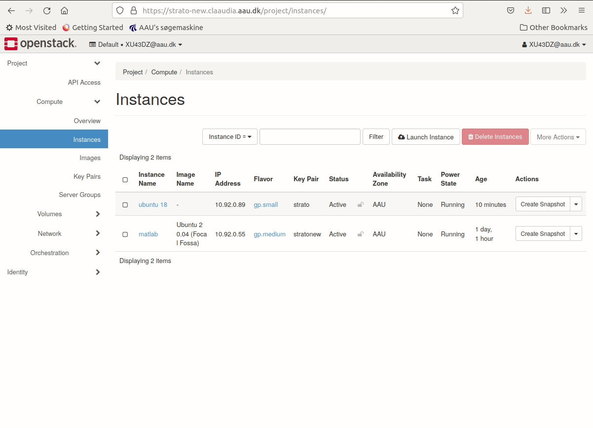

# Shutting down
Strato is a service made available to all AAU-users. The platform consists of shared hardware, and this only works if the users use the platform as intended. This is why we ask you to consider whether the ressources you have reserved for your instance, are being put to use at the moment. If not, you might be occupying ressources, that another user could benefit from.

We therefore ask you to read through our [**'Terms and Conditions'**](https://www.claaudia.aau.dk/platforms-tools/termsandconditions/) to help make this assessment.

There are a number of different ways, but here we will present the two most important. Please consult the page '[OpenStack Guides](https://www.claaudia.aau.dk/platforms-tools/termsandconditions/)' for more detailed descriptions of the options.

## Shelve instance

When you *shelve* your instance, you retain all of the data and software you might have installed on your instance, but you free up ressources for others to use.

1. Navigate to the project tab
2. Click the **Compute** sub-tab
3. Click on **Instances**
4. Find the instance and the Action roll down.
5. Select "Shelve instance". After a bit of time, the Status should be "Shelved Offloaded"
6. When you need the instance again - select "Unshelve instance" under the Actions roll-down.

{ loading=lazy }

## Delete instance
If you are done using your instance, then you can delete it. 

1. Navigate to the project tab
2. Click the **Compute** sub-tab
3. Click on **Instances**
4. Mark the checkbox of the instance you wish to delete.
5. Press **Delete Instances** on the right side of the webpage.
6. press **Delete Instances** in the confirmation dialog.

{ loading=lazy }

