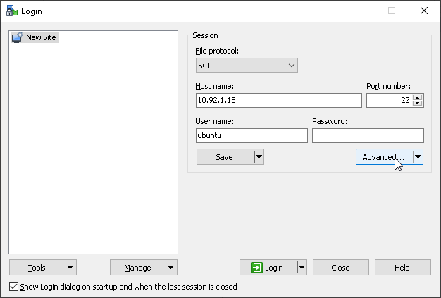
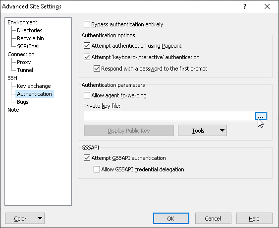
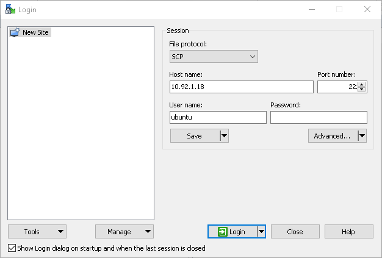
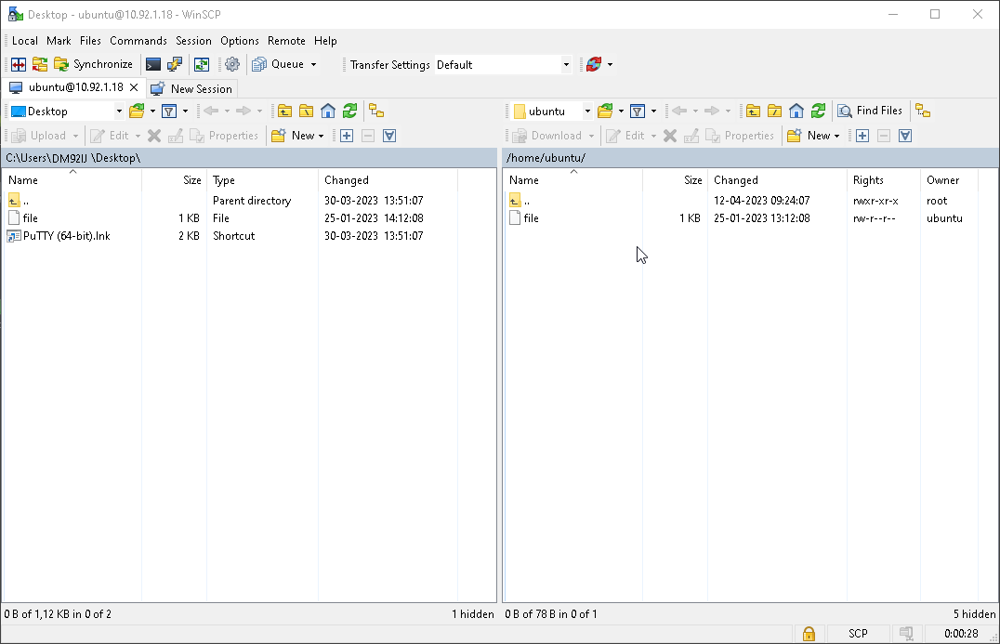

# Transferring files

In the following, we will demonstrate three ways of transfering files from your local computer to your Strato instance.

## SCP
SCP (Secure file copy) is a method for transfering files via SSH-connections. The command `scp` is available for all operating systems. 

The general command structure is as follows:

```
scp -i <my_ssh_key> -r <directory_to_be_sent> <remote_location>
```

In order to send a folder called "my_datafiles" to the home directory of my instance, you could type:

```
scp -i ~/.ssh/my_ssh_key -r my_datafiles ubuntu@10.92.1.99:~/
```

* `scp` specifies we will be using the scp protocol.
* `-i` is an additional argument for specifying an identity file (private key).
* `~/.ssh/my_ssh_key` is the conventional location of your private key.
* `-r` specifies that we want to send recursively (ie. a folder and all it's content). If you are only sending a single file, you can leave this out.
* `ubuntu` is the default username of our Ubuntu instance.
* `10.92.1.99` is the IP adress of your instance.
* `:~/` is where you want your files copied to on the remote location (`~/` is the home directory).


## Rsync
For larger file transfers it can be benefitial to use [Rsync](https://rsync.samba.org/features.html) which has a few extra features. Rsync comes preinstalled on MacOS and Linux, but is unavailable for Windows.

The basic command structure for transfering files over SSH is:
```
rsync -e "ssh -i <my_ssh_key>" <file_location> <receiver_location>
```

The command structure is essentially the same as for SCP. To send a folder called "my_datafiles", with some additional Rsync features applied, you could type:
```
rsync -e "ssh -i ~/.ssh/my_ssh_key" -vazPr my_datafiles ubuntu@10.92.1.99:~/
```

The `-vazPr` part specifies a series of options, we can apply to our transfer:

* `-v` Tells us about the status of our transfer.
* `-a` Archives the files during transfer.
* `z` Compresses the files during transfer. Can make the transfer more efficient
* `-P` Displays a progress bar of the transfer
* `-r` specifies the transfer should be recursive (ie. we want the folder and all it's content).

## WinSCP
If you are a Windows user, we recommend you use [WinSCP](https://winscp.net/) to transfer the files. WinSCP is available for download in the AAU Software Center.

* Opening the application should give you this window: 



* Choose SCP as the **"File protocol"**

* In the field **"Host name"** type in the IP-adress of your instance.

* For the SSH-protocol the standard **"Port number"** is 22.

* The field **"User name"** is a standard username that gets assigned to your instance. A list of standard usernames can be found here.   
* By standard the field **"Password"** can be left empty.

* Then click the **"Advanced Button"**, and you will be faced with this window:



* Navigate to *SSH -> Authentication* and browse to the location of your SSH-key. Select the key and press **"Open"**. 


* If you have navigated to the correct location and still can not see your SSH-key, please select **"Show all files"** as shown in the image above. Note that WinSCP only supports SSH-keys in the PuTTY-format (*.pkk*). If you have not already converted your key to this format, WinSCP will offer to do this for you, when you select the key in *.pem*-format.

* Press **"Ok"** in the "Advanced" window to apply these settings.

* You should now be back at this window. Press login.



* The first time you login you will be welcomed by a warning message, asking wether you do in fact want to connect to this adress. If you can confirm this is what you are trying to do, you can press **"Yes"**.


* You should now have a two-pane window, split vertically. On the left side you will have your local computer, and on the right side you will have the remote computer. To transfer files between them you can simply drag and drop. 


