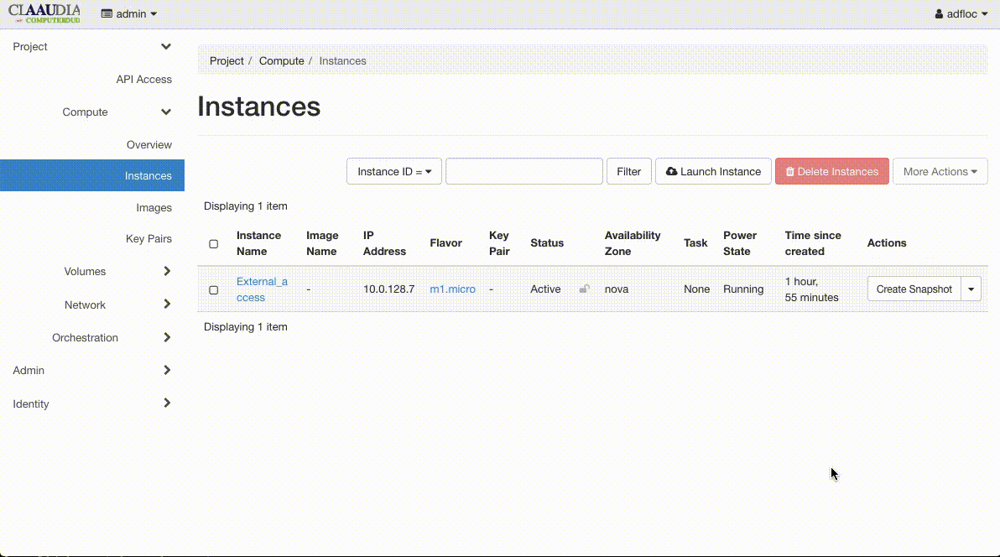
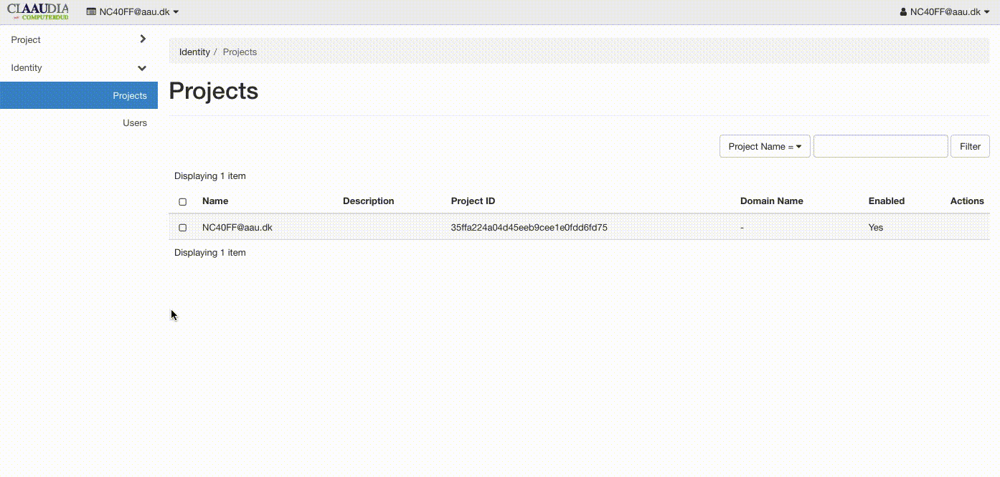

# Access to instance

Each instance has an internal fixed cloud IP address, but can also have a floating public IP address. An internal cloud IP addresses is used for communication between instances, and a floating public IP address is used for communication with networks outside the cloud, including the Internet.

## Floating IP
When you create a new instance, it will automatically be assigned an address on the **internal-shared** network. To be able to access the instance remote, you must assign a public ip address. In OpenStack the public ip's are applied using **Floating IP**.

1. Navigate to the project tab.
2. Click the **Compute** sub-tab.
3. Click on **Instances**.
4. Locate the instance you wish to allocate a floating ip. On the right hand side, in the action column, there is a button with a down arrow at the right. Click the down arrow for more options.
5. Click the **Associate Floating IP**. This will open a new window.
6. Click the **+**  by the end of **No floating IP Addresses allocated**. This will open a new window.
7. Ensure that Pool says **external**, enter a description (optional). Click **Allocate IP**, you will now return to the previous windows.
8. Ensure that an IP is selected in the **IP Address** dropdown. Ensure that the **Port to be associated** has selected the instance, which you want a floating ip for. Click **Associate**.
9. Now you will return to the instance overview. In the IP column, you will see that the server now has an ip address for external 130.x.x.x and for the internal network 10.0.x.x. You can now access the server on the external ip.



### Releasing Floating IP

Due to a limit number of IPs it's good user behaviour to release floating IPs and no to allocate more than needed.

1. Network
2. Floating IPs
3. Select the unused floating IP and press **Release Floating IPs**

## Security Groups


### SSH rule

Most images is reached by SSH, which require port 22 open.

1. Navigate to **network**
2. Click the sub menu **Security Groups**
3. Click **Manage Rules** on the default Security group
4. Add a rule
5. Choose SSH from dropdown menu.


### Custom rule

Some services require different ports open. To achieve this, the user must create a custom security rule and add it the instance

1. Navigate to **network**
2. click the sub menu **Security Groups**
3. Create new **Security group**
4. Enter name & description
5. Add a rule with a custom port



## Key-pair

Openstack authenticates per default Linux instances with a ssh key-pair. If you have to access the machine with SSH, the key-pair must be set.  

1. Navigate to **Compute**
2. Click on the sub menu **Key Pairs**
3. Add new **Key Pair**
4. Fill out name
5. Save the public key locally


### SSH access to instance

You will have root-admin access to every instance you create and can therefore install additional software, tweak the instance or simply use it as is.
**Default username is *ubuntu*** for all instances. There is no default password. Use SSH keys for safety, otherwise you muse create a user, and set a secure password your self.

 ```bash
ssh ubuntu@130.226.98.xx -i yourPersonalKey.pem
 ```

